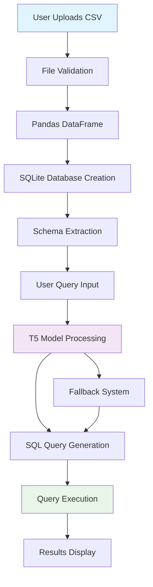

# 🧠 NeuroBase - AI-Powered Database Management System

[](https://opensource.org/licenses/MIT)
[](https://www.python.org/downloads/)
[](https://reactjs.org/)
[](https://flask.palletsprojects.com/)

NeuroBase is an intelligent database management system that allows users to interact with their CSV data using natural language queries. Built with AI-powered SQL generation, it transforms plain English questions into SQL queries and executes them on uploaded datasets.

## 🚀 Features

- **Natural Language to SQL**: Convert English questions to SQL queries using T5 transformer model
- **CSV Upload & Management**: Upload up to 5 CSV files per user with automatic SQLite conversion  
- **Multi-User Support**: Session-based user management with isolated databases
- **Real-time Query Execution**: Execute generated SQL queries with results display
- **Responsive UI**: Modern, dark-themed interface with smooth animations
- **Error Handling**: Robust fallback mechanisms and error recovery

## 🏗️ Architecture

```
┌─────────────────┐    ┌─────────────────┐    ┌─────────────────┐
│   Frontend      │    │   Backend       │    │   AI Model      │
│   (React)       │◄──►│   (Flask)       │◄──►│   (T5-Large)    │
│                 │    │                 │    │                 │
│ • File Upload   │    │ • API Routes    │    │ • NLP to SQL    │
│ • Query Input   │    │ • Session Mgmt  │    │ • Text2SQL      │
│ • Results View  │    │ • DB Operations │    │ • Query Gen     │
└─────────────────┘    └─────────────────┘    └─────────────────┘
                                │
                    ┌─────────────────┐
                    │   Database      │
                    │   (SQLite)      │
                    │                 │
                    │ • User Data     │
                    │ • CSV Tables    │
                    │ • Metadata      │
                    └─────────────────┘
```

## 📊 Data Flow



## 🛠️ Technology Stack

### Backend
- **Flask**: Web framework and API server
- **Transformers**: Hugging Face library for T5 model
- **PyTorch**: Deep learning framework
- **SQLite**: Database engine
- **Pandas**: Data manipulation

### Frontend  
- **React**: UI framework
- **Axios**: HTTP client
- **CSS3**: Modern styling with animations

### AI/ML
- **T5-Large**: Pre-trained text-to-text transformer
- **Tokenization**: Input preprocessing
- **Beam Search**: Query generation optimization

## 📋 Prerequisites

- Python 3.8 or higher
- Node.js 16 or higher  
- Git
- 4GB+ RAM (for model loading)
- CUDA-compatible GPU (optional, for acceleration)

## 🚀 Quick Start

### 1. Clone Repository
```bash
git clone https://github.com/yourusername/neurobase.git
cd neurobase
```

### 2. Backend Setup
```bash
cd server
pip install -r requirements.txt
python app.py
```

### 3. Frontend Setup
```bash  
cd client
npm install
npm start
```

### 4. Access Application
- Frontend: http://localhost:3000
- Backend API: http://localhost:5000

## 🐳 Docker Deployment

### Build Images
```bash
# Build backend
docker build -t neurobase-backend ./server

# Build frontend  
docker build -t neurobase-frontend ./client
```

### Run with Docker Compose
```bash
docker-compose up -d
```

## 🌐 Cloud Deployment Options

### Option 1: Heroku (Recommended for MVP)
- Use smaller model (T5-small) to fit within memory limits
- Deploy backend on Heroku, frontend on Vercel/Netlify

### Option 2: AWS/Google Cloud
- Use container services (ECS, Cloud Run) 
- Store model in cloud storage (S3, GCS)
- Use managed databases

### Option 3: Railway/Render
- Simple deployment with Docker support
- Automatic scaling and SSL

## 🔧 Configuration

### Environment Variables
```bash
# Backend (.env)
FLASK_ENV=production
SECRET_KEY=your-secret-key
MODEL_PATH=gaussalgo/T5-LM-Large-text2sql-spider
MAX_UPLOAD_SIZE=50MB
MAX_CSVS_PER_USER=5

# Frontend (.env)
REACT_APP_API_URL=http://localhost:5000
REACT_APP_ENV=production
```

## 📁 File Structure

```
neurobase/
├── client/                 # React frontend
│   ├── src/
│   │   ├── App.jsx        # Main component
│   │   ├── App.css        # Styling
│   │   └── index.js       # Entry point
│   └── package.json
├── server/                 # Flask backend  
│   ├── app.py             # Main server
│   ├── requirements.txt   # Dependencies
│   ├── users.json         # User data
│   └── databases/         # SQLite files
├── docker-compose.yml     # Container orchestration
├── Dockerfile.backend     # Backend container
├── Dockerfile.frontend    # Frontend container
└── README.md
```

## 🧪 Usage Examples

### 1. Upload CSV
- Login with username
- Select CSV file (max 50MB)
- Wait for processing and schema extraction

### 2. Natural Language Queries
```
"Show all students with marks greater than 90"
"Count the number of employees in each department"  
"Find the average salary by job title"
"List top 10 customers by revenue"
```

### 3. SQL Results
- Generated SQL query displayed
- Tabular results with column headers
- Row count and execution status

## 🔒 Security Features

- Session-based authentication
- File type validation  
- SQL injection prevention
- User data isolation
- Secure filename handling

## 🚀 Performance Optimizations

### Model Loading
- Lazy loading on first query
- GPU acceleration when available
- Model caching in memory

### Database Operations  
- Connection pooling
- Query result limiting (100 rows)
- Indexed common columns

### Frontend
- Component memoization
- Lazy loading for large tables
- Optimized re-renders

## 🐛 Troubleshooting

### Common Issues

1. **Model Loading Errors**
   ```bash
   # Check available memory
   free -h
   
   # Use smaller model
   MODEL_PATH=t5-small
   ```

2. **CORS Issues**
   ```bash
   # Verify CORS settings in app.py
   CORS(app, origins=["http://localhost:3000"])
   ```

3. **CSV Upload Failures**
   ```bash
   # Check file permissions
   chmod 755 ./databases/
   
   # Verify file format
   head -n 5 your_file.csv
   ```

## 🤝 Contributing

1. Fork the repository
2. Create feature branch (`git checkout -b feature/amazing-feature`)
3. Commit changes (`git commit -m 'Add amazing feature'`)
4. Push to branch (`git push origin feature/amazing-feature`)
5. Open Pull Request

## 📄 License

This project is licensed under the MIT License - see the [LICENSE](LICENSE) file for details.

## 👨‍💻 Author

**Akshat Bhatt**
- GitHub: [@akshatbhatt51](https://github.com/akshatbhatt51)
- Email: your.email@example.com

## 🙏 Acknowledgments

- Hugging Face for the T5 model
- Flask and React communities
- Open source contributors

## 🔮 Future Enhancements

- [ ] Multi-table JOIN support
- [ ] Data visualization charts  
- [ ] Export results to CSV/Excel
- [ ] Query history and bookmarks
- [ ] Advanced filtering and sorting
- [ ] Real-time collaboration
- [ ] API rate limiting
- [ ] Database backup/restore

---

⭐ **Star this repository if you found it helpful!** ⭐
