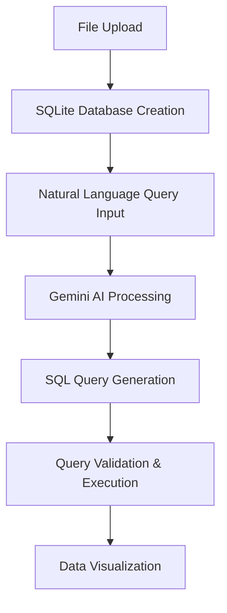

# NEUROBASE
AI-Powered Data Analysis Platform

[](https://python.org)
[](https://reactjs.org)
[](https://fastapi.tiangolo.com)

A full-stack web application that enables users to upload CSV/Excel files and query data using natural language. The platform leverages Google's Gemini AI to convert natural language questions into SQL queries and provides interactive data visualizations.

[Live Demo](https://neurobase-9352.vercel.app)

## Overview

NEUROBASE is designed to make data analysis accessible to non-technical users by providing a natural language interface for database queries. The platform automatically converts uploaded spreadsheet files into SQLite databases and uses AI to translate user questions into SQL queries.

### Core Functionality


```mermaid
graph TB
    A[File Upload] --> B[SQLite Database Creation]
    B --> C[Natural Language Query Input]
    C --> D[Gemini AI Processing]
    D --> E[SQL Query Generation]
    E --> F[Query Validation & Execution]
    F --> G[Data Visualization]
```

### Architecture

**Frontend (React 18)**
- Authentication with Firebase OAuth and demo mode fallback
- File upload interface with drag-and-drop support
- Natural language query input with real-time processing
- Interactive data visualization using Recharts
- Responsive dashboard with mobile support
- 3D immersive interface toggle

**Backend (FastAPI)**
- RESTful API with automatic documentation
- File processing for CSV, XLSX, and XLS formats
- SQLite database creation and management per user
- AI-powered query generation using Google Gemini API
- SQL query validation for security (read-only operations)
- Query execution with result formatting
- AI-generated query refinement suggestions

## Installation and Setup

### Prerequisites
- Python 3.8 or higher
- Node.js 16 or higher
- Google Gemini API key ([obtain here](https://makersuite.google.com/app/apikey))
- Firebase project (optional - demo mode available)

### Backend Setup

1. **Clone and navigate to backend directory:**
```bash
git clone https://github.com/Akshat21112005/NEUROBASE.git
cd NEUROBASE/backend
```

2. **Create virtual environment:**
```bash
python -m venv venv
# Windows
venv\Scripts\activate
# macOS/Linux
source venv/bin/activate
```

3. **Install dependencies:**
```bash
pip install -r requirements.txt
```

4. **Configure environment variables:**
Create `.env` file with required variables:
```env
GEMINI_API_KEY=your_gemini_api_key_here
SECRET_KEY=your_secret_key_here
FIREBASE_CREDENTIALS_PATH=./firebase-credentials.json
UPLOAD_FOLDER=./databases/
MAX_CSV_PER_USER=15
MAX_CONTENT_LENGTH=104857600
HOST=0.0.0.0
PORT=5000
DEBUG=False
```

5. **Start the backend server:**
```bash
python app.py
```
Server runs on `http://localhost:5000` with automatic API documentation at `/docs`

### Frontend Setup

1. **Navigate to frontend directory:**
```bash
cd ../frontend
```

2. **Install dependencies:**
```bash
npm install
```

3. **Configure environment variables:**
Create `.env.local` file:
```env
REACT_APP_API_URL=http://localhost:5000
REACT_APP_FIREBASE_API_KEY=your_firebase_api_key
REACT_APP_FIREBASE_AUTH_DOMAIN=your_project.firebaseapp.com
REACT_APP_FIREBASE_PROJECT_ID=your_project_id
REACT_APP_FIREBASE_STORAGE_BUCKET=your_project.appspot.com
REACT_APP_FIREBASE_MESSAGING_SENDER_ID=your_sender_id
REACT_APP_FIREBASE_APP_ID=your_app_id
```

4. **Start the development server:**
```bash
npm start
```
Application runs on `http://localhost:3000`

## Usage Guide

### Data Upload Process
1. Access the application through the login page or demo mode
2. Navigate to the dashboard and select "Upload File"
3. Choose CSV, XLSX, or XLS files (maximum 100MB)
4. The system automatically creates a SQLite database from your data
5. Database appears in your databases list for querying

### Natural Language Querying
1. Select a database from your uploaded files
2. Enter questions in plain English (e.g., "Show me the top 10 sales by region")
3. The AI processes your question and generates appropriate SQL queries
4. Results display as both tabular data and interactive charts
5. Use AI-suggested follow-up questions for deeper analysis

### Data Visualization
The platform automatically selects appropriate chart types based on data characteristics:
- **Bar charts** for categorical comparisons
- **Line charts** for time series data
- **Pie charts** for proportional data
- **Scatter plots** for correlation analysis
- **Area charts** for cumulative data

## Technical Implementation

### Backend Architecture

**Core Components:**
- `app.py` - Main FastAPI application with all endpoints
- `databases/` - Directory storing user SQLite databases
- Authentication system with Firebase Admin SDK integration
- File processing pipeline using pandas for data transformation

**Key Endpoints:**
- `POST /login` - User authentication
- `POST /upload` - File upload and database creation
- `POST /query` - Natural language to SQL conversion and execution
- `GET /databases` - List user databases
- `DELETE /databases/{db_name}` - Database deletion
- `POST /refine` - AI-powered query refinement suggestions

**Security Features:**
- SQL injection prevention through query validation
- Read-only SQL operations (SELECT statements only)
- User data isolation with separate databases
- Session management with JWT tokens
- File size and type validation

### Frontend Architecture

**Main Components:**
- `App.jsx` - Root component with routing and context providers
- `LoginPage.jsx` - Authentication interface
- `ProfessionalDashboard.jsx` - Main dashboard with sections for databases, querying, and visualization
- `ChartContainer.jsx` - Dynamic chart rendering based on data types

**State Management:**
- React Context for authentication state
- Custom hooks for database operations (`useDatabase`)
- Custom hooks for query execution (`useQuery`)
- Notification system for user feedback

**UI Framework:**
- Tailwind CSS for styling
- Framer Motion for animations
- Lucide React for icons
- Recharts for data visualization

### Dependencies

**Backend Dependencies:**
```
fastapi>=0.104.1
uvicorn[standard]>=0.24.0
python-multipart>=0.0.6
pandas>=2.2.0
python-dotenv>=1.0.0
google-generativeai>=0.3.0
firebase-admin>=6.2.0
requests>=2.31.0
openpyxl>=3.1.2
xlrd>=2.0.1
itsdangerous>=2.1.2
```

**Frontend Dependencies:**
```
react: ^18.2.0
react-dom: ^18.2.0
react-router-dom: ^6.8.1
tailwindcss: ^3.2.6
framer-motion: ^10.0.1
firebase: ^9.17.2
recharts: ^2.5.0
axios: ^1.3.4
lucide-react: ^0.321.0
```

## Configuration

### Environment Variables

**Backend (.env):**
```env
GEMINI_API_KEY=your_gemini_api_key_here
SECRET_KEY=your_secret_key_here
FIREBASE_CREDENTIALS_PATH=./firebase-credentials.json
UPLOAD_FOLDER=./databases/
MAX_CSV_PER_USER=15
MAX_CONTENT_LENGTH=104857600
HOST=0.0.0.0
PORT=5000
DEBUG=False
```

**Frontend (.env.local):**
```env
REACT_APP_API_URL=http://localhost:5000
REACT_APP_FIREBASE_API_KEY=your_firebase_api_key
REACT_APP_FIREBASE_AUTH_DOMAIN=your_project.firebaseapp.com
REACT_APP_FIREBASE_PROJECT_ID=your_project_id
REACT_APP_FIREBASE_STORAGE_BUCKET=your_project.appspot.com
REACT_APP_FIREBASE_MESSAGING_SENDER_ID=your_sender_id
REACT_APP_FIREBASE_APP_ID=your_app_id
```

### Firebase Setup (Optional)
1. Create a Firebase project at [Firebase Console](https://console.firebase.google.com)
2. Enable Authentication with Google provider
3. Generate service account credentials and save as `firebase-credentials.json` in backend directory
4. Add Firebase configuration to frontend environment variables

## API Documentation

The backend provides automatic API documentation at `/docs` when running. Key endpoints:

### Authentication
- `POST /login` - Authenticate user with Firebase token or demo mode

### File Management
- `POST /upload` - Upload CSV/Excel files and create SQLite databases
- `GET /databases` - Retrieve list of user databases
- `DELETE /databases/{db_name}` - Delete specific database

### Query Operations
- `POST /query` - Execute natural language queries against selected database
- `POST /refine` - Get AI-suggested query refinements

## Troubleshooting

### Common Issues

**Backend fails to start:**
- Verify Gemini API key is correctly set in `.env`
- Check Python version compatibility (3.8+)
- Ensure all dependencies are installed

**Frontend cannot connect to backend:**
- Confirm `REACT_APP_API_URL` matches backend server address
- Check if backend server is running on specified port
- Verify CORS configuration allows frontend domain

**Authentication issues:**
- Firebase authentication is optional - demo mode works without setup
- Verify Firebase configuration if using Google OAuth
- Check Firebase credentials file path in backend

**File upload failures:**
- Supported formats: CSV, XLSX, XLS
- Maximum file size: 100MB
- Ensure file has proper column headers
- Check file encoding (UTF-8 recommended)

**Query execution errors:**
- Only SELECT statements are allowed for security
- Verify database contains data
- Check column names in natural language queries

## Deployment

### Production Deployment

**Backend (Render):**
1. Connect GitHub repository to Render
2. Set build command: `pip install -r requirements.txt`
3. Set start command: `python app.py`
4. Configure environment variables in Render dashboard

**Frontend (Vercel):**
1. Connect GitHub repository to Vercel
2. Set root directory to `frontend`
3. Build command: `npm run build`
4. Configure environment variables in Vercel dashboard

 
 

### Project Structure
```
NEUROBASE/
├── backend/
│   ├── app.py              # Main FastAPI application
│   ├── requirements.txt    # Python dependencies
│   ├── .env.example       # Environment variables template
│   └── databases/         # SQLite databases storage
├── frontend/
│   ├── src/
│   │   ├── components/    # React components
│   │   ├── context/       # React context providers
│   │   ├── hooks/         # Custom React hooks
│   │   ├── constants/     # Application constants
│   │   └── styles/        # Styling configuration
│   ├── package.json       # Node.js dependencies
│   └── .env.example      # Environment variables template
└── README.md
```

### Adding New Features

**Backend Extensions:**
- Add new endpoints in `app.py`
- Implement additional AI models for query processing
- Extend file format support
- Add data export capabilities

**Frontend Enhancements:**
- Create new dashboard sections
- Implement additional chart types
- Add data filtering and sorting
- Enhance mobile responsiveness

## Security Considerations

- SQL queries are validated to prevent injection attacks
- Only SELECT operations are permitted
- User data is isolated in separate SQLite databases
- Firebase authentication provides secure user management
- Session tokens are managed securely
- File uploads are validated for type and size

## Performance

- SQLite databases provide fast query execution for moderate datasets
- Pandas optimizes data processing and transformation
- React components use efficient rendering patterns
- Charts are rendered client-side for responsive interactions
- API responses are optimized for minimal payload size

## License

MIT License - see [LICENSE](LICENSE) for details.

## Contributing

1. Fork the repository
2. Create a feature branch (`git checkout -b feature/new-feature`)
3. Make your changes with appropriate tests
4. Commit changes (`git commit -m 'Add new feature'`)
5. Push to branch (`git push origin feature/new-feature`)
6. Create a Pull Request

## Support

For issues and questions:
- Create an issue on [GitHub](https://github.com/Akshat21112005/NEUROBASE/issues)
- Check existing documentation and troubleshooting guide
- Review API documentation at `/docs` endpoint

---

**Developed by [Akshat Bhatt](https://github.com/Akshat21112005)**
