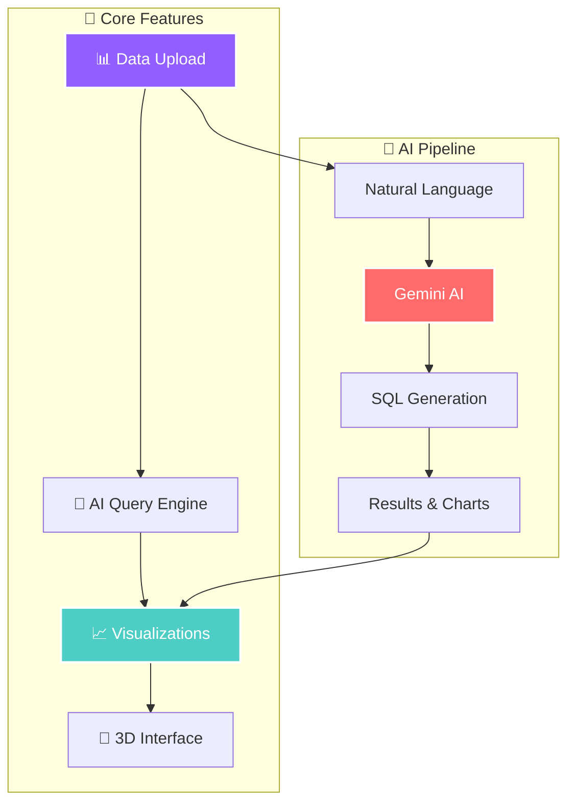
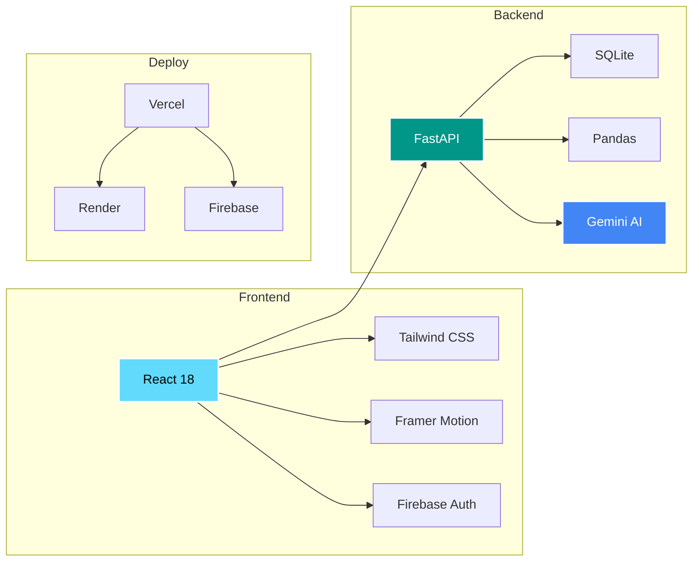
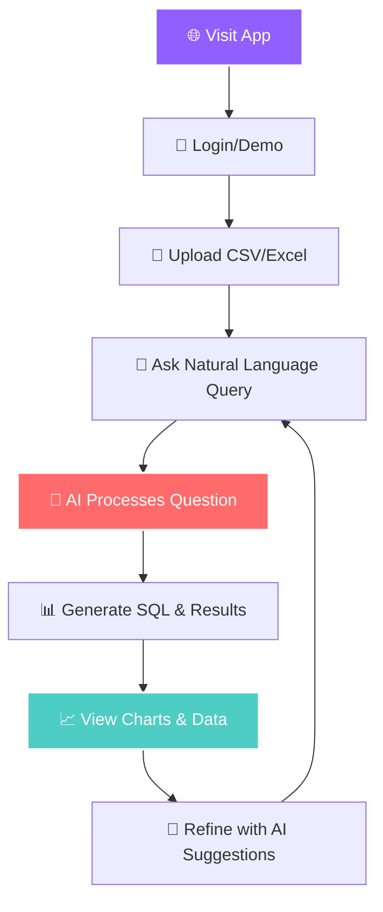
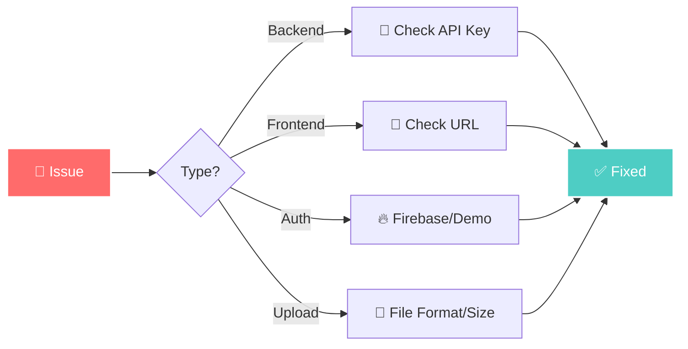

# 🧠 NEUROBASE
> AI-Powered Data Analysis Platform

[](https://github.com/Akshat21112005/NEUROBASE)
[](https://python.org)
[](https://reactjs.org)
[](https://fastapi.tiangolo.com)

**Upload CSV files, ask questions in natural language, get AI-powered insights**

[🚀 Live Demo](https://neurobase-9352.vercel.app)

## ✨ What is NEUROBASE?

<div align="center">


```mermaid
graph TB
    subgraph "🎯 Core Features"
        A[📊 Data Upload] --> B[🧠 AI Query Engine]
        B --> C[📈 Visualizations]
        C --> D[🎨 3D Interface]
    end
    
    subgraph "🔄 AI Pipeline"
        E[Natural Language] --> F[Gemini AI]
        F --> G[SQL Generation]
        G --> H[Results & Charts]
    end
    
    A --> E
    H --> C
    
    style A fill:#915EFF,stroke:#fff,stroke-width:2px,color:#fff
    style F fill:#FF6B6B,stroke:#fff,stroke-width:2px,color:#fff
    style C fill:#4ECDC4,stroke:#fff,stroke-width:2px,color:#fff
```

</div>

A full-stack web application that lets you upload CSV/Excel files and query your data using natural language. Powered by Google's Gemini AI to convert your questions into SQL queries and visualize results.

**Key Features:**
- 🔐 Firebase authentication (with demo mode)
- 📊 Upload CSV, XLSX, XLS files  
- 🧠 AI-powered natural language queries
- 📈 Interactive data visualizations
- 🎨 Modern 3D interface

## 🛠️ Tech Stack


```mermaid
graph LR
    subgraph "Frontend"
        A[React 18] --> B[Tailwind CSS]
        A --> C[Framer Motion]
        A --> D[Firebase Auth]
    end
    
    subgraph "Backend"
        E[FastAPI] --> F[SQLite]
        E --> G[Pandas]
        E --> H[Gemini AI]
    end
    
    subgraph "Deploy"
        I[Vercel] --> J[Render]
        I --> K[Firebase]
    end
    
    A --> E
    
    style A fill:#61DAFB,stroke:#fff,stroke-width:2px,color:#000
    style E fill:#009688,stroke:#fff,stroke-width:2px,color:#fff
    style H fill:#4285F4,stroke:#fff,stroke-width:2px,color:#fff
```

**Frontend:** React 18 + Tailwind CSS + Framer Motion  
**Backend:** FastAPI + SQLite + Pandas  
**AI:** Google Gemini API  
**Auth:** Firebase (Google OAuth)  
**Deploy:** Vercel (Frontend) + Render (Backend)

## 🚀 Quick Start

### Prerequisites
- Python 3.8+, Node.js 16+
- Gemini API Key ([Get one here](https://makersuite.google.com/app/apikey))
- Firebase project (optional - has demo mode)

### Backend Setup
```bash
git clone https://github.com/Akshat21112005/NEUROBASE.git
cd NEUROBASE/backend

python -m venv venv
venv\Scripts\activate

pip install -r requirements.txt

echo "GEMINI_API_KEY=your_api_key_here" > .env

python app.py
```

### Frontend Setup
```bash
cd ../frontend
npm install

echo "REACT_APP_API_URL=http://localhost:5000" > .env.local

npm start
```

Visit `http://localhost:3000` to see the app!

## 📖 How to Use


```mermaid
flowchart TD
    A[🌐 Visit App] --> B[🔐 Login/Demo]
    B --> C[📁 Upload CSV/Excel]
    C --> D[💬 Ask Natural Language Query]
    D --> E[🤖 AI Processes Question]
    E --> F[📊 Generate SQL & Results]
    F --> G[📈 View Charts & Data]
    G --> H[🔄 Refine with AI Suggestions]
    H --> D
    
    style A fill:#915EFF,stroke:#fff,stroke-width:2px,color:#fff
    style E fill:#FF6B6B,stroke:#fff,stroke-width:2px,color:#fff
    style G fill:#4ECDC4,stroke:#fff,stroke-width:2px,color:#fff
```

1. **Upload Data**: Click "Upload File" and select your CSV/Excel file
2. **Ask Questions**: Type natural language queries like "What are the top 10 sales?"
3. **View Results**: See generated SQL, data tables, and interactive charts
4. **Explore**: Use AI-suggested follow-up questions for deeper insights

## 🔧 Configuration

### Environment Variables

**Backend (.env):**
```env
GEMINI_API_KEY=your_gemini_api_key
SECRET_KEY=your_secret_key
FIREBASE_CREDENTIALS_PATH=./firebase-credentials.json
```

**Frontend (.env.local):**
```env
REACT_APP_API_URL=http://localhost:5000
REACT_APP_FIREBASE_API_KEY=your_firebase_key
REACT_APP_FIREBASE_AUTH_DOMAIN=your_domain
REACT_APP_FIREBASE_PROJECT_ID=your_project_id
```

## 🐛 Common Issues


```mermaid
flowchart LR
    A[🚫 Issue] --> B{Type?}
    B -->|Backend| C[🔑 Check API Key]
    B -->|Frontend| D[🔗 Check URL]
    B -->|Auth| E[🔥 Firebase/Demo]
    B -->|Upload| F[📁 File Format/Size]
    
    C --> G[✅ Fixed]
    D --> G
    E --> G
    F --> G
    
    style A fill:#FF6B6B,stroke:#fff,stroke-width:2px,color:#fff
    style G fill:#4ECDC4,stroke:#fff,stroke-width:2px,color:#fff
```

**Backend won't start:** Check if Gemini API key is set in `.env`  
**Frontend can't connect:** Verify `REACT_APP_API_URL` points to backend  
**Firebase auth fails:** App works in demo mode without Firebase setup  
**File upload fails:** Ensure file is CSV/XLSX/XLS and under 100MB

## 📄 License

MIT License - see [LICENSE](LICENSE) for details.

## 🤝 Contributing

1. Fork the repository
2. Create feature branch (`git checkout -b feature/amazing-feature`)
3. Commit changes (`git commit -m 'Add amazing feature'`)
4. Push to branch (`git push origin feature/amazing-feature`)
5. Open Pull Request

---

**Made with ❤️ by [Akshat Bhatt](https://github.com/Akshat21112005)**

[🚀 **Live Demo**](https://neurobase-9352.vercel.app) • [⭐ **Star on GitHub**](https://github.com/Akshat21112005/NEUROBASE)
